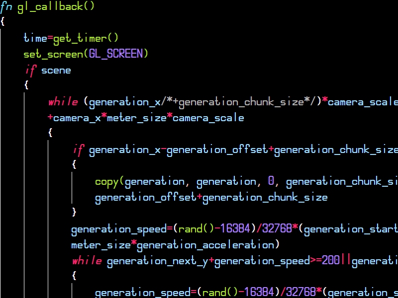

# Pixilang highlight
Подсветка синтаксиса для языка программирования Pixilang.\

Вы сможете более удобно писать аудиозвуковые приложения благодаря цветовому разделению языковых объектов.
## В следующем релизе
* Подсветка тегов документации.
## В будущем
* Семантическая подсветка синтаксиса.
* Структура кода.
* Автоподстановка выражений.
* Вывод документации.
* Переход к реализации.